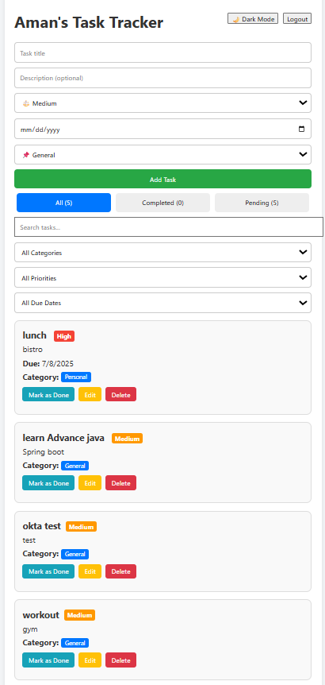
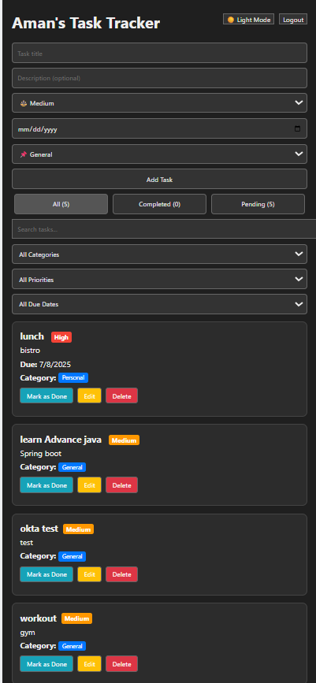

# ✅ Personal Task Tracker

A full-stack MERN (MongoDB, Express, React, Node.js) application that allows users to manage their daily tasks with features like filtering, priority tagging, dark mode, and due dates.

---

## 📝 Description

Personal Task Tracker helps users:
- Log in with a simple name
- Create, update, delete tasks
- Add due dates, priority, categories
- Filter and search tasks
- Toggle between dark and light mode

---

## 🚀 Features

- 🔐 Simple username-based login
- ➕ Add tasks with title, description, due date, category, and priority
- ✅ Mark tasks as completed or pending
- 🔍 Filter by:
  - Status: All / Completed / Pending
  - Category: Work / Study / Personal, etc.
  - Priority: High / Medium / Low
  - Due Date: Today / Upcoming / Overdue
  - Search by keyword
- 🌙 Dark mode toggle
- ⚡ Smooth animations with Framer Motion

---

## ⚙️ Setup Instructions

1. Clone the repository:
   ```bash
   git clone https://github.com/AmanTiwari404/task-tracker.git
   ```

2. Navigate to the frontend directory:
   ```bash
   cd frontend
   ```

3. Install dependencies:
   ```bash
   npm install
   ```

4. Start the frontend development server:
   ```bash
   npm start
   ```

5. Make sure the backend is running on:
   ```
   http://localhost:5000
   ```

6. Open the frontend in your browser:  
   [http://localhost:3000](http://localhost:3000)

---

## 🧰 Technologies Used

- React.js
- Express.js
- Node.js
- MongoDB Atlas
- Framer Motion (animations)
- Vercel (for frontend hosting)
- Render (for backend hosting)

---

## 🌐 Live Demo

**Frontend Live URL**  
🔗 [https://task-tracker-blond-two.vercel.app/](https://task-tracker-blond-two.vercel.app/)

> Backend must also be deployed on [Render](https://render.com) for full functionality

---

## 🖼️ Screenshots

| Dashboard (Light Mode) | Dashboard (Dark Mode) |
|------------------------|------------------------|
|  |  |

---

## ✅ Deployment Notes

- Deployed frontend via **Vercel**
- Backend deployed on **Render**
- `.env` contains:
  ```env
  REACT_APP_API_BASE=https://your-backend.onrender.com/api/tasks
  ```

---


## 📃 License

MIT License

